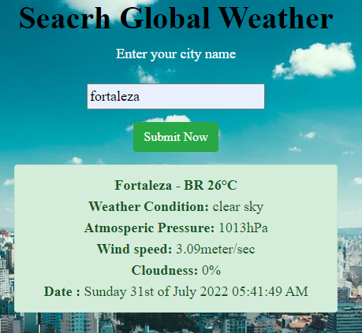
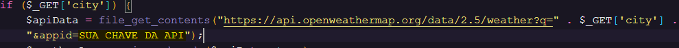

# weather-app

<h2>Veja informações sobre o clima de sua cidade.</h2>

 
******************************************************************************  

Aplicação Desenvolvida para testar os conhecimentos: Consumo de Api's e seguindo os desafios do repositorio: 
<a href=“https://github.com/florinpop17/app-ideas“>florinpop17 app-ideas</a>
  
*****************************************************************************
<h2>API Consumida OpenWeather</h2>
<a href="https://openweathermap.org/">API OpenWeather</a>

Após o cadastro você receberá sua chave no email , insira nesse campo "SUA CHAVE DA API".
 

  

Divirta-se e bons estudos!

